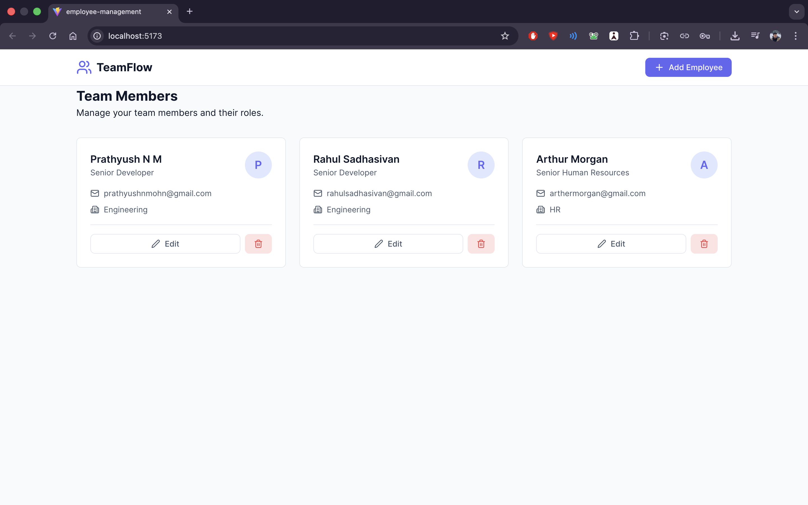

# TeamFlow - Employee Management System

A premium, responsive Employee Management application built with React and Vite. This project demonstrates modern frontend development practices, including component-based architecture, state management, and responsive design.



## 🚀 Features

- **✨ Modern UI/UX**: Clean, minimalist design with smooth transitions and glassmorphism effects.
- **📱 Fully Responsive**: Seamless experience across desktop, tablet, and mobile devices.
- **👥 CRUD Operations**: Complete management of employee records (Create, Read, Update, Delete).
- **💾 Local Persistence**: Data is saved to the browser's LocalStorage, so you don't lose your work on refresh.
- **🔍 Real-time Updates**: Immediate UI feedback for all actions.

## 🛠️ Tech Stack

- **Frontend Framework**: [React 18](https://reactjs.org/)
- **Build Tool**: [Vite](https://vitejs.dev/)
- **Styling**: Vanilla CSS with CSS Variables (Theming)
- **Icons**: [Lucide React](https://lucide.dev/)
- **Utilities**: [UUID](https://github.com/uuidjs/uuid) for unique identifiers

## 🏃‍♂️ Getting Started

Follow these steps to run the project locally:

1.  **Clone the repository**
    ```bash
    git clone https://github.com/probablynotnmp/employee-management.git
    cd employee-management
    ```

2.  **Install dependencies**
    ```bash
    npm install
    ```

3.  **Start the development server**
    ```bash
    npm run dev
    ```

4.  **Open in browser**
    Navigate to `http://localhost:5173` to view the app.

## 📁 Project Structure

```
src/
├── components/         # Reusable UI components
│   ├── EmployeeForm.jsx
│   ├── EmployeeList.jsx
│   ├── Header.jsx
│   └── Modal.jsx
├── App.jsx            # Main application logic
├── index.css          # Global styles and theme variables
└── main.jsx           # Entry point
```

## 🤝 Contributing

Contributions are welcome! Please feel free to submit a Pull Request.

## 📄 License

This project is licensed under the MIT License - see the [LICENSE](LICENSE) file for details.
